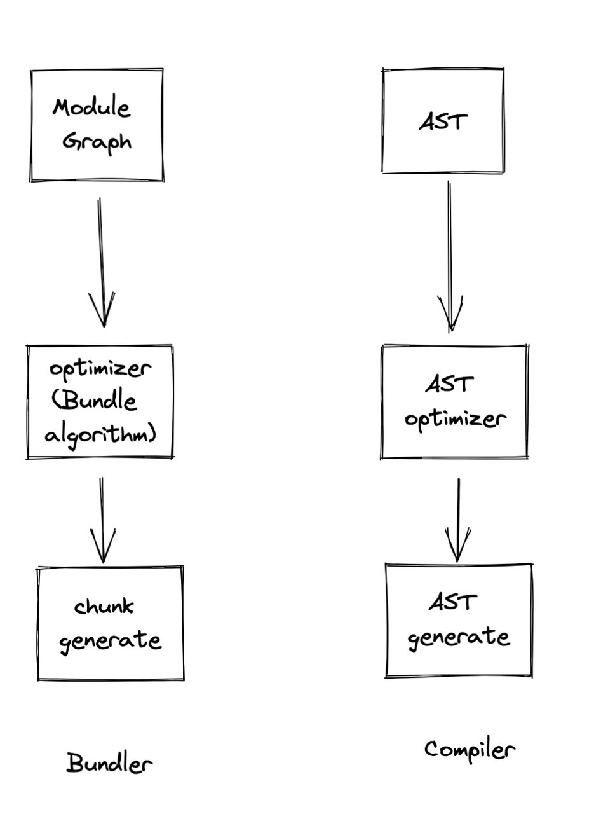

# Bundler的设计与实现(Crafting Bundler)
- [Bundler的设计与实现(Crafting Bundler)](#bundler的设计与实现crafting-bundler)
  - [核心概念和设计(Core Concepts and Design)](#核心概念和设计core-concepts-and-design)
    - [Bundler](#bundler)
    - [编译模式(Compiler \& Compilation)](#编译模式compiler--compilation)
    - [模块与依赖 (Module \& Dependency)](#模块与依赖-module--dependency)
      - [模块(Module)](#模块module)
      - [一等公民模块 (First Class Module)](#一等公民模块-first-class-module)
      - [TypeScript 是否应该作为一等公民 (TypeScript ? First Class Module)](#typescript-是否应该作为一等公民-typescript--first-class-module)
      - [依赖(Dependency)](#依赖dependency)
      - [普通模块和 Context 模块 (Normal Module \& Context Module)](#普通模块和-context-模块-normal-module--context-module)
      - [模块工厂（Module Factory）](#模块工厂module-factory)
      - [模块路径解析 (Module Resolution)](#模块路径解析-module-resolution)
      - [虚拟模块 (Virtual Module)](#虚拟模块-virtual-module)
      - [Monorepo 支持 （Monorepo Support）](#monorepo-支持-monorepo-support)
      - [Parser](#parser)
      - [Loader](#loader)
    - [分块 (Chunk)](#分块-chunk)
      - [代码拆分 （Code Splitting）](#代码拆分-code-splitting)
      - [代码分割 （Bundle Splitting）](#代码分割-bundle-splitting)
    - [代码生成 （Code Generation）](#代码生成-code-generation)
      - [ESM vs Custom Runtime](#esm-vs-custom-runtime)
      - [ESM \& CJS Interop](#esm--cjs-interop)
      - [Runtime](#runtime)
  - [核心功能实现 （Core Implementation）](#核心功能实现-core-implementation)
    - [模块扫描（Scan）](#模块扫描scan)
    - [模块链接（Link）](#模块链接link)
    - [错误处理](#错误处理)
    - [Sourcemap](#sourcemap)
    - [插件系统设计（Plugin Design）](#插件系统设计plugin-design)
      - [转换 过滤 和 处理 （Transform \& Filter \& Module Type）](#转换-过滤-和-处理-transform--filter--module-type)
      - [Loader架构 和 Transform 架构区别 （Loader vs Transform hook）](#loader架构-和-transform-架构区别-loader-vs-transform-hook)
      - [AST 复用 (AST Reuse)](#ast-复用-ast-reuse)
    - [模块热重载 （HMR）](#模块热重载-hmr)
      - [HMR的分类 （Live Reload \& Hot Module Reload(HMR) \& Fast-Refresh）](#hmr的分类-live-reload--hot-module-reloadhmr--fast-refresh)
      - [增量构建 （Incremental Build）](#增量构建-incremental-build)
    - [代码拆分 和 代码分割 （Code Splitting \& Bundle Splitting）](#代码拆分-和-代码分割-code-splitting--bundle-splitting)
    - [摇树优化 （Tree Shaking）](#摇树优化-tree-shaking)
    - [作用域提升 （Scope Hoisting）](#作用域提升-scope-hoisting)
    - [Layer 和 React 服务端组件 （Layer \& RSC）](#layer-和-react-服务端组件-layer--rsc)
    - [模块联邦（Module Federation）](#模块联邦module-federation)

## 核心概念和设计(Core Concepts and Design)
### Bundler
深入讲解 Bundler 之前，先要理解下 Bundler 这个概念，很多人会把 Bundler 和 Build Tools 之类的概念搞混，Bundler 最为核心的功能为将一个项目转换为 一个 Module Graph 并进一步转换为 一个优化的 Chunk Graph并基于 Chunk 和 Module 生成产物的过程. 常见的 Bundler 包括 Webpack、Rspack、Rollup、Parcel、Esbuild等

> [!NOTE]  
>Webpack is just a module bundler which turns a dependency graph into an optimized chunk graph.

而在 Bundler 上封装了很多提供的开箱即用的功能的工具则称为 Build Tools更为合适，包括 Rsbuild、Vite、Create-react-app等。
根据上面的描述 Bundler的核心流程其实只有三步，
1. 生成  Module Graph（scan），
2. 基于 Module Graph 生成优化的 Chunk Graph(Link)
3. 以及最后的基于Chunk的代码生成(CodeGen),
这个过程和传统的编译器的三步过程十分相近
1. 生成 AST 
2. AST 优化
3. 代码生成

### 编译模式(Compiler & Compilation)
一般的 Bundler 都提供了两种编译模式，Build 和 Watch 模式，其中 Build 模式主要用于生产环境构建，一般编译完进程或者任务就终止，而 Watch 模式则会继续监听用户项目的变动，项目变动后会触发新的编译，Watch 还有一种更高级的模式既 Reload 模式，其不仅仅会重新编译产物，还会触发新的产物重新执行（这里的执行包括在 浏览器和 Node等环境下的重新执行），大部分 Bundler 都会提供两个子命令或者参数区分这两种模式。

Bundler 通常需要创建一个编译上下文来执行编译，这个上下文包括用户的配置和宿主的执行环境(如FS)，这些上下文在整个编译过程中通常是不变的，在 Webpack 下这个实例称为 Compiler，同时在 Watch 模式下，每次修改还需要创建一个独立新的编译上下文实例，这里需要一个独立的示例是为了避免多个编译同时存在互相干扰，这个编译实例和当前的项目内容绑定包含项目相关的一些数据结构，如 Module Graph、Chunk Graph等，这个实例在 Webpack 中称为 Compilation。

### 模块与依赖 (Module & Dependency)
Module 和 Dependency 是 Bundler 中最为核心的概念，其贯穿了 Bundler 构建流程的始终,其也是 Webpack 核心架构最为关键和最为复杂的概念。
#### 模块(Module)
我们首先了解下 Webpack 内 Module 的概念, Module 最为核心的作用即为 
#### 一等公民模块 (First Class Module)
Webpack5 中一个最被忽视的架构设计变动就是支持了更多的一等公民，CSS、Asset等常用的类型不再需要转换成 JavaScript 才能被Bundler识别，这提供了更多的优化的可能性和更简化的配置。
Rollup 和 Webpack 最大的一个区别在于，Rollup 是 JavaScript Bundler， 而 Webpack 是 Web Bundler, 在 Rollup 中如果需要支持 CSS、Asset、Json 等非JavaScript的 Module的打包，需要将其转换为 JavaScript Module，而 Webpack 中天然的支持 Css Module、Asset Module、Json Module 等 Module类型。
#### TypeScript 是否应该作为一等公民 (TypeScript ? First Class Module)

#### 依赖(Dependency)
Webpack 中的 Dependency 是一个复杂的概念，其同时承载了多种功能
#### 普通模块和 Context 模块 (Normal Module & Context Module)
#### 模块工厂（Module Factory）
#### 模块路径解析 (Module Resolution)
#### 虚拟模块 (Virtual Module)
#### Monorepo 支持 （Monorepo Support）
#### Parser
#### Loader

### 分块 (Chunk)
#### 代码拆分 （Code Splitting）
#### 代码分割 （Bundle Splitting）

### 代码生成 （Code Generation）

#### ESM vs Custom Runtime
#### ESM & CJS Interop
#### Runtime

## 核心功能实现 （Core Implementation）
### 模块扫描（Scan）

### 模块链接（Link）
### 错误处理
### Sourcemap
### 插件系统设计（Plugin Design）

#### 转换 过滤 和 处理 （Transform & Filter & Module Type）

#### Loader架构 和 Transform 架构区别 （Loader vs Transform hook）

#### AST 复用 (AST Reuse)

### 模块热重载 （HMR）
#### HMR的分类 （Live Reload & Hot Module Reload(HMR) & Fast-Refresh）

#### 增量构建 （Incremental Build）
### 代码拆分 和 代码分割 （Code Splitting & Bundle Splitting）

### 摇树优化 （Tree Shaking）

### 作用域提升 （Scope Hoisting）

### Layer 和 React 服务端组件 （Layer & RSC）

### 模块联邦（Module Federation）

